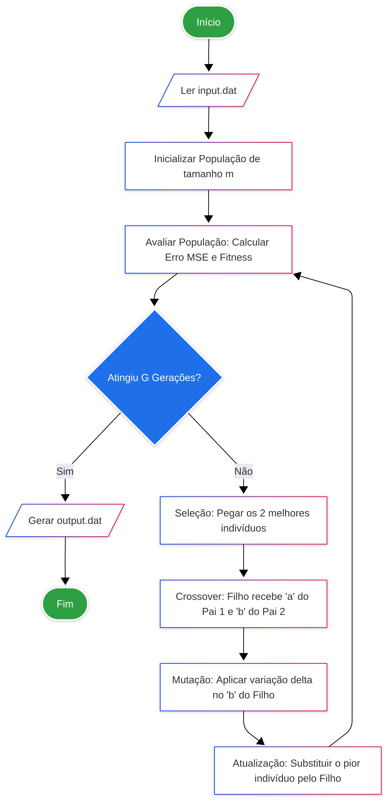

# <h1 align="center"> 🧬Otimizador Genético Linear🧬 </h1>

<p align="center">
  
  
</p>

## :page_with_curl: Introdução
<p align="justify">
  
Nesse trabalho, o ajuste de curvas e a regressão linear é um problema de otimização: o objetivo é encontrar os parâmetros de uma função matemática que melhor descrevam um conjunto de dados observados. O uso de uma meta-heurística evolutiva permite que o computador "aprenda" os melhores coeficientes através de sucessivas gerações de tentativas, erros, cruzamentos e mutações, aproximando-se gradativamente da reta ideal que minimiza as distâncias para os pontos do conjunto de dados.
</p>
 
## :bookmark_tabs: Descrição do projeto

Este projeto busca o desenvolvimento de um simulador computacional baseado em Algoritmo Genético destinado a ajustar uma função afim $\hat{y}=ax+b$ a um conjunto de pontos bidimensionais $(x, y)$. A representação computacional da população é feita através de objetos modulares alocados dinamicamente. Cada indivíduo carrega em seu "DNA" os genes $a$ e $b$, e a sua aptidão evolui ao longo da simulação de acordo com o Erro Quadrático Médio (MSE) em relação ao dataset.
<p>
<p align="justify">
Além da simulação do cálculo matemático, tambem utilizamos o controle geracional, aplicando as fases de avaliação de aptidão (fitness), seleção dos mais aptos, reprodução (crossover) e mutação genética para manter a diversidade da população.
<p>
<p align="justify">
Este trabalho foi proposto pelo professor Michel Pires Silva, instrutor da disciplina Algoritmos e Estrutura de Dados I, do Centro Federal de Educação Tecnológica de Minas Gerais (CEFET - MG), Campus V - Divinópolis.
<p>

### :pushpin: 1. Representação da População
<p align="justify">
  A população de soluções candidatas é representada computacionalmente por meio de estruturas dinâmicas <code>std::vector</code>. Cada elemento corresponde a um Indivíduo com atributos específicos:
</p>

- **Genes (a, b)**: Coeficientes da reta.
- **Erro**: Discrepância calculada entre a reta do indivíduo e os pontos reais.
- **Fitness**: Valor de aptidão inversamente proporcional ao erro ($\frac{1}{1 + erro}$).

### :pushpin: 2. Simulação do Processo Evolutivo

<p align="justify">
  A evolução da população ocorre de forma iterativa ao longo de $G$ gerações, seguindo um conjunto de regras biológicas adaptadas para a matemática.
</p>

#### 2.1 Regras de Propagação:
<p align="justify">
  A cada iteração, toda a população é avaliada e ranqueada de acordo com o fitness. O algoritmo aplica o elitismo puro, selecionando os dois indivíduos mais aptos (Pai 1 e Pai 2). O cruzamento genético ocorre mesclando o coeficiente angular ($a$) do Pai 1 com o coeficiente linear ($b$) do Pai 2 para gerar uma nova solução candidata (Filho).
</p>

#### 2.2 Mutação Genética:
<p align="justify">
  Para evitar a convergência prematura (estagnação evolutiva), o Filho recém-criado sofre uma mutação controlada. Um valor estocástico $\delta$ entre -0.5 e 0.5 é somado ao seu parâmetro $b$, simulando uma adaptação ambiental e garantindo a exploração de novos resultados.
</p>

#### 2.3 Regras de Substituição:
<p align="justify">
  O ambiente simula a sobrevivência do mais apto. Após a geração e mutação do Filho, o indivíduo com o pior desempenho (menor fitness) de toda a população é sumariamente eliminado e substituído pelo novo descendente.
</p>

## 🖥️ Ambiente de Criação

O código foi desenvolvido utilizando as seguintes ferramentas:

[](https://learn.microsoft.com/cpp/)
[](https://code.visualstudio.com/docs/?dv=linux64_deb)
[](https://www.debian.org/)


## :file_folder: Estrutura Geral do Projeto

A estrutura do projeto é disposta da seguinte maneira:

```text
Algoritmo-Genetico-AJuste-Linear/
├── Makefile                   # Script para automação da compilação
├── README.md                  # Documentação principal do projeto
├── include/                   # Arquivos de cabeçalho
    ├── AlgoritmoGenetico.hpp  # Estrutura do controlador evolutivo 
    └── Individuo.hpp          # Estrutura do cromossomo/solução 
├── src/                       # Código-fonte das implementações (C++)
    ├── AlgoritmoGenetico.cpp  # Lógica das gerações, seleção e cruzamento
    ├── Individuo.cpp          # Cálculos de avaliação (MSE) e mutação
    └── main.cpp               # Execução principal do programa
├── data/                      # Diretório de dados operacionais
    ├── input.dat              # Arquivo lido pela simulação (N, M, G e coordenadas)
    └── output.dat             # Relatório gerado com os resultados
└── misc/                      # Arquivos diversos 
    ├── Fluxograma.png         # Fluxograma 
    ├── input.dat              # Modelo de exemplo para o arquivo de entrada
    └── Trab 1 Aeds.pdf        # Documento com a especificação do trabalho
```

## 👨‍💻 Implementação

O fluxo de execução do nosso Otimizador Genético segue um ciclo contínuo de avaliação e evolução. A implementação foi estruturada de forma modular.

O processo funciona através das seguintes etapas, mapeadas passo a passo no fluxograma:
<details>
  <summary><b>Clique aqui para visualizar o Fluxograma do Algoritmo</b></summary>
  
  <div align="center">
    
  </div>

</details>

1. **Inicialização:** A execução começa lendo o arquivo `input.dat` **(Passo 1)** para obter os dados reais. Em seguida, a população inicial de tamanho $m$ é instanciada **(Passo 2)** com valores completamente aleatórios para os genes `a` (coeficiente angular) e `b` (coeficiente linear).
2. **Avaliação (Fitness):** Na etapa de avaliação **(Passo 3)**, o programa calcula o Erro Quadrático Médio (MSE) e a aptidão de cada indivíduo em relação aos pontos do dataset. Quanto menor o erro, maior a aptidão.
3. **Decisão e Finalização:** O algoritmo testa a todo momento se o limite de $G$ gerações foi atingido **(Passo 4)**. Quando isso acontece, o ciclo se encerra e o arquivo `output.dat` é gerado apenas com os acertos finais **(Passo 9)**.
4. **Ciclo Evolutivo:** Enquanto o limite de gerações não é atingido, a população evolui através de:
   - **Seleção e Crossover:** Os dois melhores indivíduos são selecionados via elitismo **(Passo 5)** para gerar um "Filho", misturando a inclinação de um com a altura do outro **(Passo 6)**.
   - **Mutação e Substituição:** Esse Filho sofre uma pequena mutação estocástica aplicando uma variação $\delta$ no eixo Y **(Passo 7)**. Por fim, ele substitui o pior indivíduo da população atual **(Passo 8)**, e o sistema retorna para a fase de avaliação.


## 💬🎯 Análises e Conclusões

A validação da modelagem foi feita observando o log em `output.dat`. Nas gerações iniciais, o erro apresenta grande oscilação, configurando retas que cruzam os pontos de maneira caótica. No entanto, por causa da heurística de substituir sempre o pior indivíduo, a população global se torna cada vez mais precisa. 

Notou-se que a mutação é o motor secundário essencial: sem uma variação $\delta$ bilateral (positiva e negativa), os filhos gerados pelo crossover elitista poderiam "travar" num mínimo local matemático, nunca alcançando o menor Erro Quadrático Médio possível.

### 🧪 Caso de Teste e Validação

Para testar se o algoritmo realmente funciona na prática, foi criado um cenário onde a resposta já era conhecida. Usei a função matemática $f(x) = 2x + 3$ para calcular e gerar os pontos que vão no arquivo `input.dat`.

O desafio do programa era olhar apenas para as coordenadas $(x, y)$ e "adivinhar" a fórmula original, ou seja, evoluir até encontrar os coeficientes exatos $a = 2$ e $b = 3$.

**Exemplo dos pontos utilizados:**
Para gerar os dados do teste, basta substituir o valor de $x$ na fórmula:
* Se $x = 1$, então $y = 5$
* Se $x = 2$, então $y = 7$
* Se $x = 3$, então $y = 9$
* Se $x = 4$, então $y = 11$
* Se $x = 5$, então $y = 13$

**Resultado Final:**
Ao final das gerações, o algoritmo conseguiu encontrar exatamente a reta que gerou esses pontos. O arquivo `output.dat` registra esse acerto, mostrando que o programa encontrou $a = 2$ e $b = 3$, com a taxa de erro tendendo a zero.

### ⏱️Análise Assintótica

A eficiência do Algoritmo Genético depende profundamente da dimensão da população ($m$) e da quantidade de gerações ($G$).

* No módulo `Individuo.cpp`, a função `avaliar` possui complexidade de tempo de $O(n)$, pois precisa iterar por todos os $n$ pontos do dataset para calcular o erro global (MSE).
* No módulo `AlgoritmoGenetico.cpp`, o laço geracional engloba a avaliação da população inteira, custando $O(m \times n)$. A etapa de ordenação dos indivíduos pelo melhor fitness utiliza o `std::sort` do C++, que apresenta complexidade assintótica de tempo de $O(m \log m)$.
* Operações de crossover, mutação pontual e descarte do pior elemento possuem impacto constante de tempo, $O(1)$. 
* O espaço de memória consumido é majoritariamente $O(m + n)$, refletindo o vetor da população e o vetor do dataset.

| **Operação Genética** | **Tempo (Pior Caso)** | **Espaço (Memória)** |
|-----------------------|-----------------------|----------------------|
| `avaliar()`           | $O(n)$              | $O(1)$               |
| Laço de Avaliação     | $O(m \times n)$       | -                    |
| Seleção (`std::sort`) | $O(m \log m)$         | $O(1)$   |
| Mutação e Crossover   | $O(1)$              | $O(1)$               |
| **Total (Global)** | **$O(G \times (m \times n + m \log m))$** | **$O(m + n)$** |

**Legenda**:
- **G**: Número total de gerações.
- **m**: Tamanho da população.
- **n**: Quantidade de pontos do dataset.


## ⚙️ Instalação e Configuração 

Para a execução correta do software, é recomendado o seguinte ambiente:
  * Compilador C++ (g++ recomendado, com suporte a C++11 ou superior)
  * Utilitário `Make` para *build* .
  * Ambiente Linux (Debian/Ubuntu).

### **Passos e Comandos**

#### **1. Clone o repositório**
No terminal, digite o seguinte comando para clonar o repositório:
```bash
git clone https://github.com/KairoHenrique/Algoritmo-Genetico-AJuste-Linear

```

#### **2. Acessar o diretório do projeto**
No terminal, navegue até a pasta raiz do repositório recém-clonado:
```bash
cd Algoritmo-Genetico-AJuste-Linear
```

#### **3. Arquivo de Dados (`input.dat`)**
Certifique-se de que existe um arquivo `input.dat` na pasta data com os parâmetros na primeira linha (n, m, G) e as coordenadas x e y nas linhas seguintes. Exemplo:
```text
5 20 100
1.0 3.1
2.0 4.9
...
```

#### **4. Compilar o projeto:**
Comando para compilar:
```bash
make
```
*(Caso queira forçar uma recompilação limpa, utilize `make clean` antes de `make`)*.

#### **5. Executar o projeto:**
```bash
make run
```
A execução lerá os dados e gerará o arquivo **`output.dat`** contendo os acertos finais encontrados pelo algoritmo para os coeficientes.

**Exemplo de Saída (`output.dat`):**
O arquivo gerará o log de evolução detalhado de cada geração.
```text
Geracao 1 | Fitness: 0.182201 | Erro: 4.48845 | a: 1.27293 | b: 4.35681
Geracao 2 | Fitness: 0.182201 | Erro: 4.48845 | a: 1.27293 | b: 4.35681
...
Geracao 37 | Fitness: 0.948123 | Erro: 0.0547155 | a: 1.27293 | b: 2.35005
...
Geracao 100 | Fitness: 0.957048 | Erro: 0.0448798 | a: 1.27293 | b: 2.26949
```
*(Note como o Erro diminui e o Fitness aumenta rapidamente conforme a população evolui).*

## 👥 Desenvolvedor do Projeto

<div align="center">
  <a href="https://github.com/KairoHenrique">
    
  </a>
  <br>
  <strong>Kairo Henrique Ferreira Martins</strong>
  <br>
  Estudante de Engenharia de Computação no CEFET-MG.
  <br>
  📧 Email: <a href="mailto:kairohenrique293@gmail.com">kairohenrique293@gmail.com</a>
</div>

## :computer: Ambiente de teste
Este projeto foi executado:
  * **Processador**: 12th Gen Intel® Core™ i7-1255U
  * **Memoria RAM**: 40GB DDR4 3200MHz.
  * **Sistema Operacional**: Debian GNU/Linux 13
  * **Compilador**: GCC (g++).

## ⚙️ Recursos Utilizados
<p align="left">
  
  
</p>
